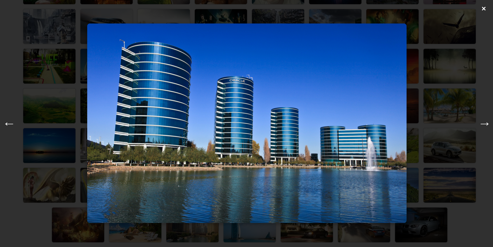

# PHPgalery
Простая и надежная галерея на PHP. Работает очень быстро и подходит для встраивания как модуль. Смотрит альбомы в images, в котором каталоги albumname. Выбор альбома через php-параметр galeryproject.php?album=albumname. Есть флаги для темной темы и отображения кнопок альбомов (генерятся по названиям каталогов). К галерее представляю python-скрипт, который в каждом каталоге генерит миниатюры. Просто добавляем в Cron и пусть оно работает. Если по какой-то причине галерея не находит миниатюру, генерит на лету из оригинала изображения (медленно, если не хватает достаточно много миниатюр, зато не ломается). Для работы скрипта нужны PIL, ffmpeg и tqdm. Поддерживаются jpg|jpeg|png|gif|mp4|webm|avi 

